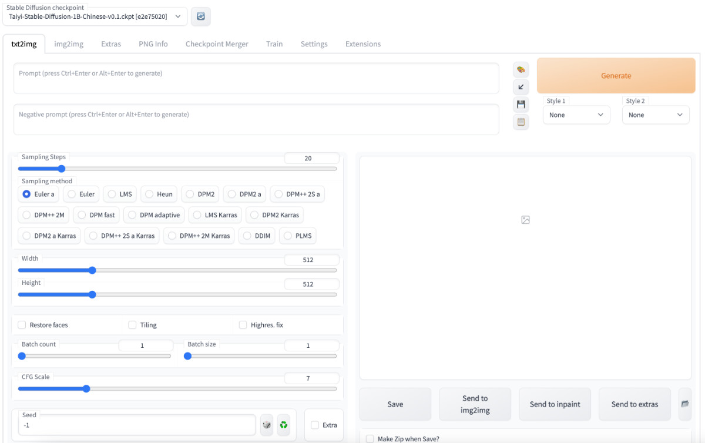

# Docker Stable Diffusion Taiyi

为中文 Stable Diffusion Taiyi(太乙) 准备的容器运行环境，内置 Web UI，干净透明，开箱即用。


## 快速上手

如果你本地已经准备好了运行 `Docker` 的环境，并且有一张显存在 4G 到 8G 之间的显卡，可以尝试使用下面这个镜像，镜像在 DockerHub 上的尺寸为 8GB（官方镜像 10G+）

如果你手头没有显卡，也不想使用云主机，**那么可以等等后续不需要 GPU 的“模型把玩”文章**，或者翻阅之前有关模型的文章 :D

```bash
docker pull soulteary/stable-diffusion:taiyi-0.1
```

想运行“太乙”，除了需要下载“模型游乐场”镜像之外，我们还需要获取“太乙模型”文件：

```bash
git clone https://huggingface.co/IDEA-CCNL/Taiyi-Stable-Diffusion-1B-Chinese-v0.1
```

整个仓库尺寸比较大（大概有 18GB），需要花费一些时间：

```bash
Cloning into 'Taiyi-Stable-Diffusion-1B-Chinese-v0.1'...
remote: Enumerating objects: 157, done.
remote: Counting objects: 100% (157/157), done.
remote: Compressing objects: 100% (155/155), done.
remote: Total 157 (delta 77), reused 0 (delta 0), pack-reused 0
Receiving objects: 100% (157/157), 3.06 MiB | 22.25 MiB/s, done.
Resolving deltas: 100% (77/77), done.
Filtering content: 100% (5/5), 8.92 GiB | 11.48 MiB/s, done.
```

原始项目启用了 `git lfs`，所以添加不添加 `--depth` 参数没有差别，耐心等待模型下载完毕之后，我们编写一个容器编排文件，来启动模型应用：

```yaml
version: "2"
services:

  taiyi:
    image: soulteary/stable-diffusion:taiyi-0.1
    container_name: taiyi
    restart: always
    runtime: nvidia
    ipc: host
    ports:
      - "7860:7860"
    volumes:
      - ./Taiyi-Stable-Diffusion-1B-Chinese-v0.1:/stable-diffusion-webui/models/Taiyi-Stable-Diffusion-1B-Chinese-v0.1
```

将上面的内容保存为 `docker-compose.yml` 之后，执行 `docker compose up -d`，稍等片刻，在浏览器访问启动服务的 IP 地址和对应端口，比如：`http://localhost:7860`，就能够正常使用啦。



模型运行起来，当然是要玩一把了，我使用博客首页的古诗“醉里不知天在水，满船清梦压星河”为主题，尝试生成了一张图，看起来效果还不错：


想要快速上手中文 Stable Diffusion 模型的同学，看到这里就可以啦。

如果你想了解如何从零开始配置 GPU 云服务器环境，或者想了解这个 Stable Diffusion 容器运行环境是如何构建的，可以继续阅读[这篇文章](https://soulteary.com/2022/12/09/use-docker-to-quickly-get-started-with-the-chinese-stable-diffusion-model-taiyi.html)。

## 相关项目

- [“封神榜”模型](https://github.com/IDEA-CCNL/Fengshenbang-LM)
- [“太乙”的 Web UI](https://github.com/IDEA-CCNL/stable-diffusion-webui)
- [Huggingface 项目页面](https://huggingface.co/IDEA-CCNL/Taiyi-Stable-Diffusion-1B-Chinese-v0.1)
